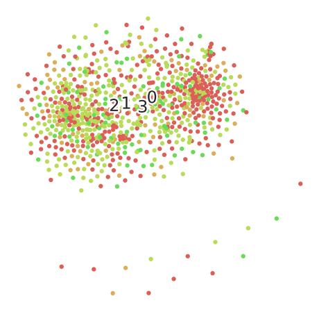
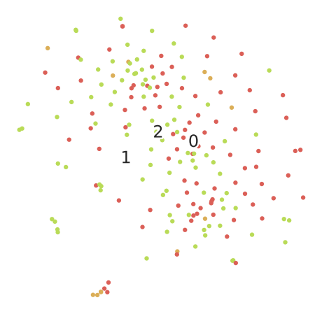
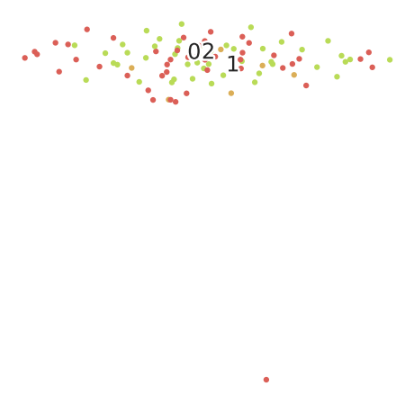
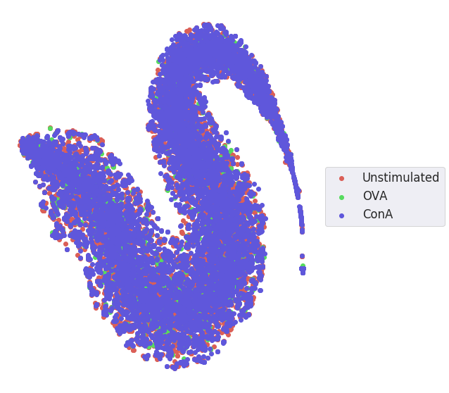
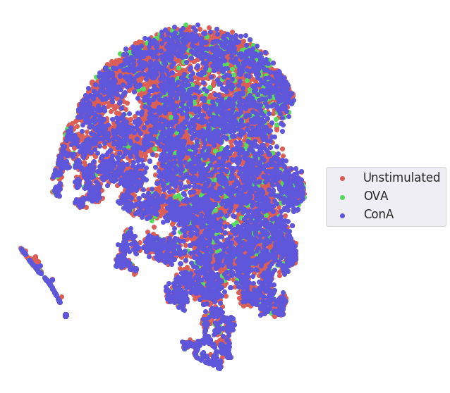
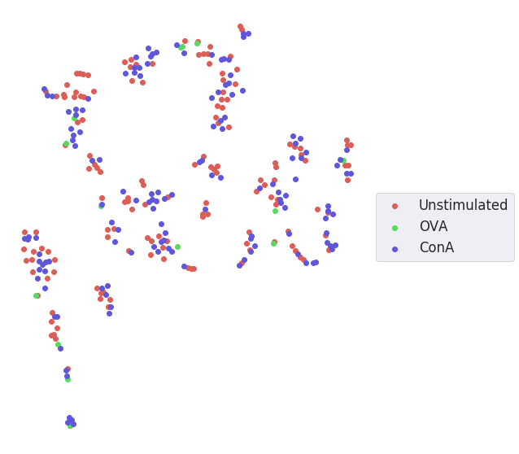

# Evaluating different clustering models

## Attempt 1

### Autoencoder model

```python
## model from knot classifier
input_img = Input(shape=(imw, imh, c))

x = Conv2D(16, (3, 3), activation='relu', padding='same')(input_img)
x = MaxPooling2D((2, 2), padding='same')(x)
x = Conv2D(8, (3, 3), activation='relu', padding='same')(x)
x = MaxPooling2D((2, 2), padding='same')(x)
x = Conv2D(8, (3, 3), activation='relu', padding='same')(x)
encoded = MaxPooling2D((2, 2), padding='same')(x)

x = Conv2D(8, (3, 3), activation='relu', padding='same')(encoded)
x = UpSampling2D((2, 2))(x)
x = Conv2D(8, (3, 3), activation='relu', padding='same')(x)
x = UpSampling2D((2, 2))(x)
x = Conv2D(16, (3, 3), activation='relu', padding="same")(x)
x = UpSampling2D((2, 2))(x)
decoded = Conv2D(1, (3, 3), activation='sigmoid', padding='same')(x)
```

### Results

* Results without calculating overlap


* Results with overlap
```python
tsne = TSNE(random_state=RS, perplexity=5, n_iter=500).fit_transform(x_overlap)
```


* Results with DMSO dataset

```python
tsne = TSNE(random_state=RS, perplexity=5, learning_rate=10, n_iter=2500).fit_transform(encoded_imgs_flat)
```



* Results with DMSO dataset overlapped



## Attempt 2 - model 11 (12*12*8 core layer)

```python
input_img = Input(shape=(imw, imh, c))

x = Conv2D(32, (3, 3), padding='same')(input_img)
x = LeakyReLU()(x)
x = MaxPooling2D((2, 2), padding='same')(x)
x = Conv2D(16, (3, 3), padding='same')(x)
x = LeakyReLU()(x)
x = MaxPooling2D((2, 2), padding='same')(x)
x = Conv2D(8, (3, 3), padding='same')(x)
x = LeakyReLU()(x)
x = MaxPooling2D((2, 2), padding='same')(x)
encoded = Flatten()(x)

x = Conv2D(8, (3, 3), padding='same')(x)
x = LeakyReLU()(x)
x = UpSampling2D((2, 2))(x)
x = Conv2D(16, (3, 3), padding='same')(x)
x = LeakyReLU()(x)
x = UpSampling2D((2, 2))(x)
x = Conv2D(32, (3, 3), padding="same")(x)
x = LeakyReLU()(x)
x = UpSampling2D((2, 2))(x)
decoded = Conv2D(c, (3, 3), activation='sigmoid', padding='same')(x)
```

### Results



Does not seem to differentiate between the conditions.

-> try again with different parameters.
-> look into combining the two images first?

## Attempt 3 - model 12 (2-channel image)



## Attempt 4 - model 12, but tuned



* This one in particular is with perplexity 5, learning rate 200.
* Different changes in parameters yields the same: shape changes but the different conditions overlap.
* So problem is coming from data.
