# Evaluating different autoencoder models

Please give:
* Structure (layers)
* Optimiser (incl. parameters if applicable)
* Loss function
* Epochs, other parameters
* Photos of reconstruction
* Does the loss value move?
* Do the weights of the layers change? (We want our encoder model to have learnt something)

## Model 1

### Structure

```python
x =  Conv2D(32, (3, 3), activation='relu', padding='same')(input_img)
x = MaxPooling2D((2, 2), padding='same')(x)
x = Conv2D(16, (3, 3), activation='relu', padding='same')(x)
x = MaxPooling2D((2, 2), padding='same')(x)
x = Conv2D(16, (3, 3), activation='relu', padding='same')(x)
x = MaxPooling2D((2, 2), padding='same')(x)
encoded = Flatten()(x)

x =  Conv2D(16, (3, 3), activation='relu', padding='same')(x)
x = UpSampling2D((2, 2))(x)
x =  Conv2D(16, (3, 3), activation='relu', padding='same')(x)
x = UpSampling2D((2, 2))(x)
x =  Conv2D(32, (3, 3), activation='relu', padding='same')(x)
x = UpSampling2D((2, 2))(x)
decoded = Conv2D(1, (3, 3), padding='same')(x)
```

### Parameters

* Optimiser = adam
* Loss function = binary_crossentropy
* n epochs = 30
* batch size = 48

### Images

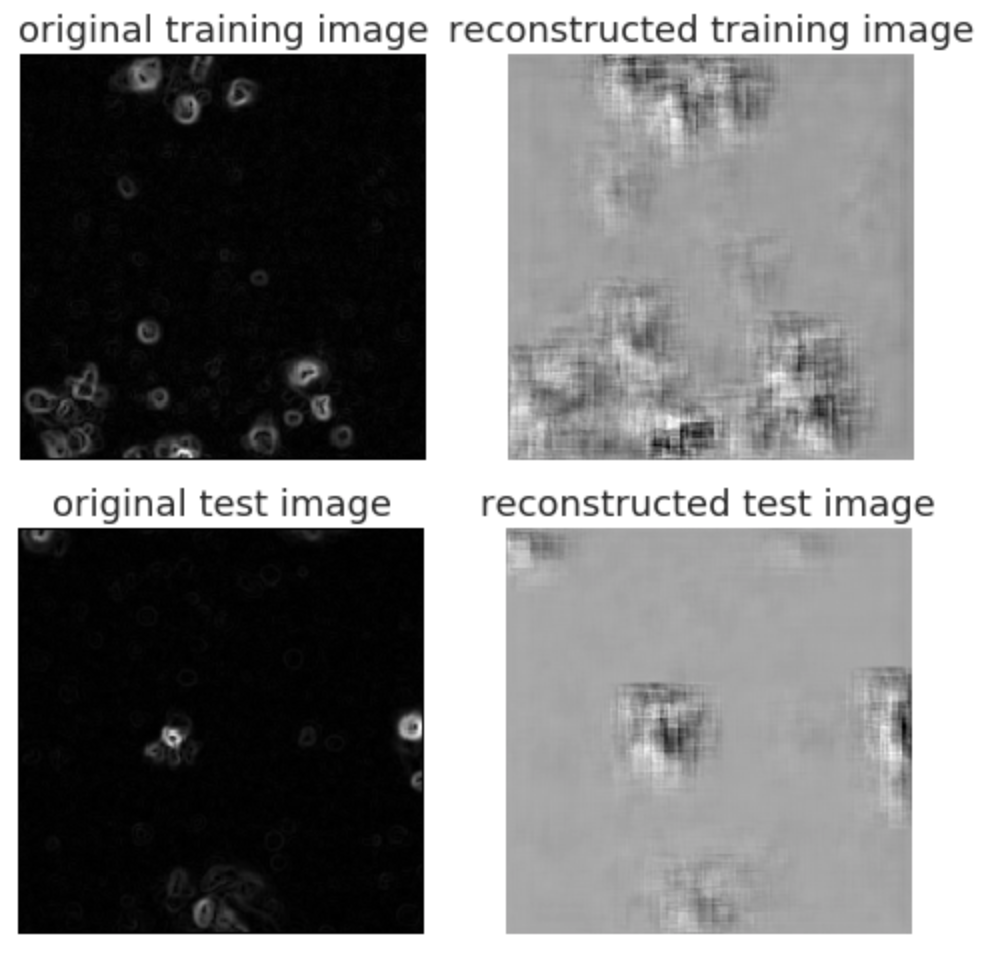
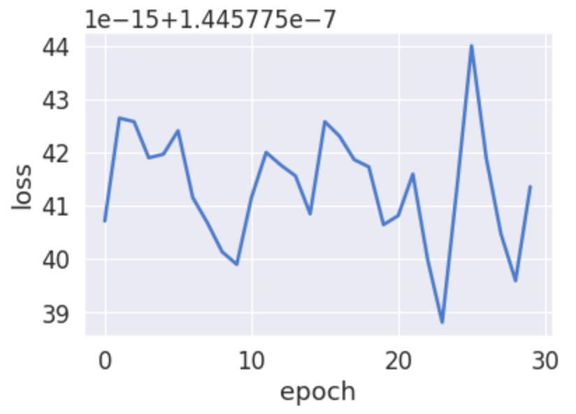

### Results

* Loss does not seem to reach a plateau; need longer epoch
* Weights do not change; need more training data?

### Next up

* Augment dataset; see if it makes any changes with this basic model


## Model 2 - doubled up dataset

Rationale: see if duplicating the dataset produces any change whatsoever. If not another parameter might be at fault

### Structure, parameters

See [model 1](#model-1).

### Images

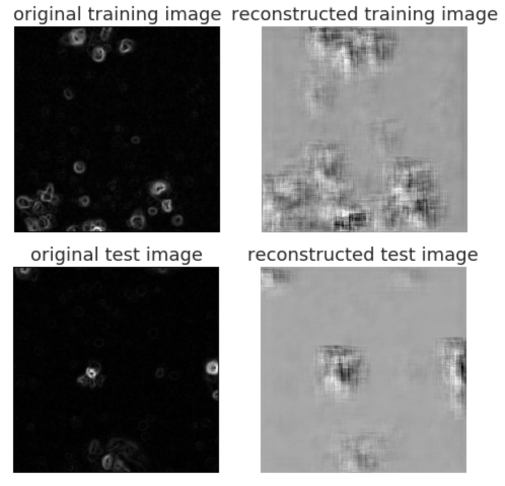
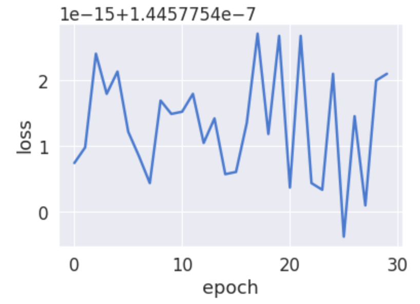

### Results

* Compared to model 1, loss is much more irregular (but approximation does not change)
* output does not change at all

### Next up

* Change optimiser; see if there is any change at all

## Model 3

Changed the optimiser to adadelta. No change visualised.
I will try another autoencoder structure on the data; if nothing changes, data augmentation might be the way to go.

## Interlude: clustering encoded images with this model

```python
tsne = TSNE(random_state=RS, perplexity=12, learning_rate=250.0).fit_transform(encoded_imgs)
```
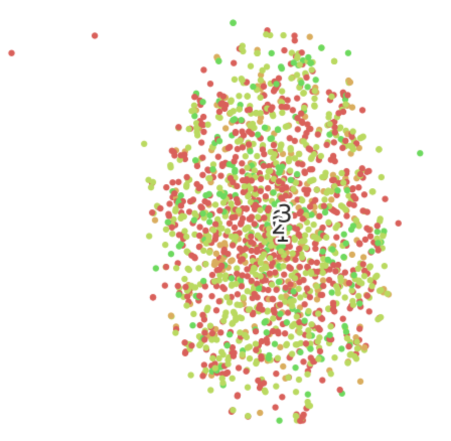

* Upping the perplexity then made it more of a ball (we don't want that)
* Lower perplexity seems to return a bit more outliers

```python
tsne = TSNE(random_state=RS, perplexity=4, learning_rate=250.0).fit_transform(encoded_imgs)
```
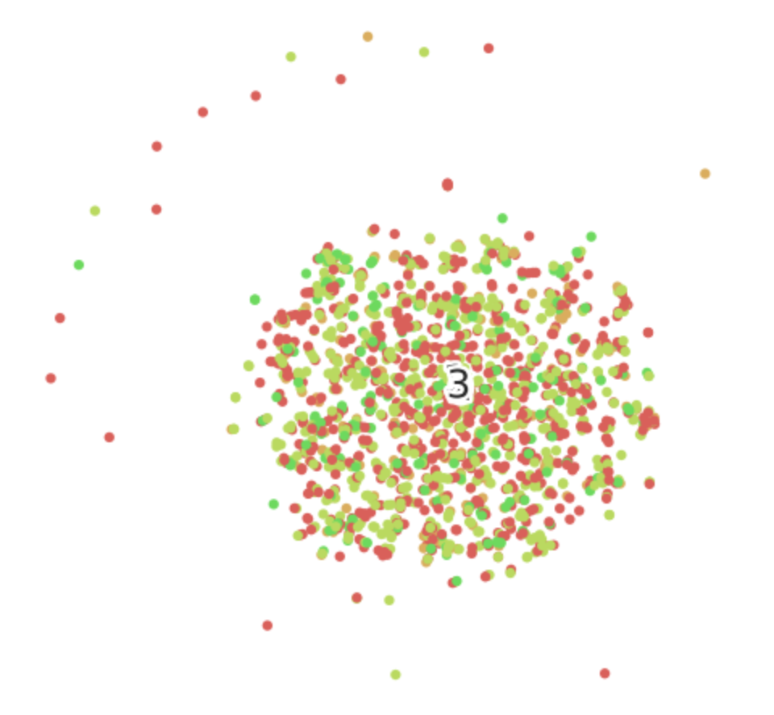

## Model 4

### Structure

```python
x = Conv2D(64, (5, 5), padding='same')(input_img)
x = LeakyReLU()(x)
x = MaxPooling2D((2, 2), padding='same')(x)
x = Conv2D(32, (5, 5), padding='same')(x)
x = LeakyReLU()(x)
x = MaxPooling2D((2, 2), padding='same')(x)
x = Conv2D(16, (2, 2), padding='same')(x)
x = LeakyReLU()(x)
x = MaxPooling2D((2, 2), padding='same')(x)
encoded = Flatten()(x)

x = Conv2D(16, (2, 2), padding='same')(x)
x = LeakyReLU()(x)
x = UpSampling2D((2, 2))(x)
x = Conv2D(32, (5, 5), padding='same')(x)
x = LeakyReLU()(x)
x = UpSampling2D((2, 2))(x)
x =  Conv2D(64, (5, 5), padding='same')(x)
x = LeakyReLU()(x)
# this will help going back the original image dimensions
x = UpSampling2D((2, 2))(x)

decoded = Conv2D(1, (3, 3), padding='same')(x)
```

### Parameters

* Optimiser = adam
* Loss function = binary_crossentropy
* n epochs = 30
* batch size = 48

### Images

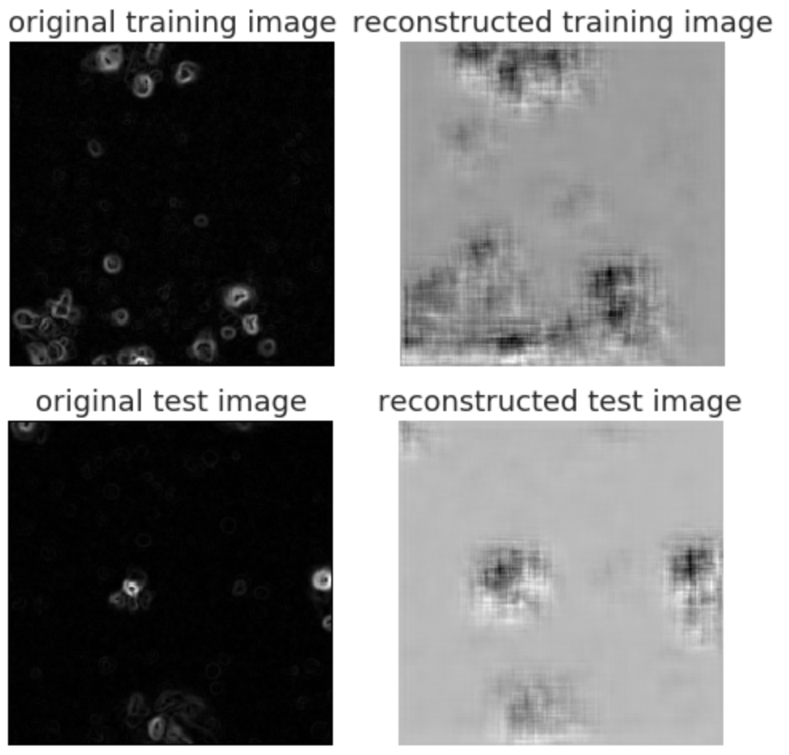
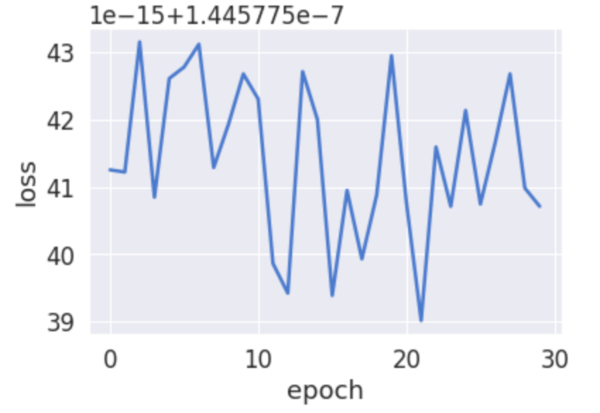

### Results

* Still nothing changing. The model does not seem to actually be learning anything significant.

### Next up

* Add an image plot to see if the prediction changes before and after training the model. *--> UPDATE: no it doesn't for the models above.*
* Test the structure on a different dataset to see if the length of the data is the problem.
* If so, need to do data augmentation.

## Model 5: CIFAR + model 4

### Parameters

* Optimiser = adam
* Loss function = binary_crossentropy
* n epochs = 30
* batch size = 48

### Images

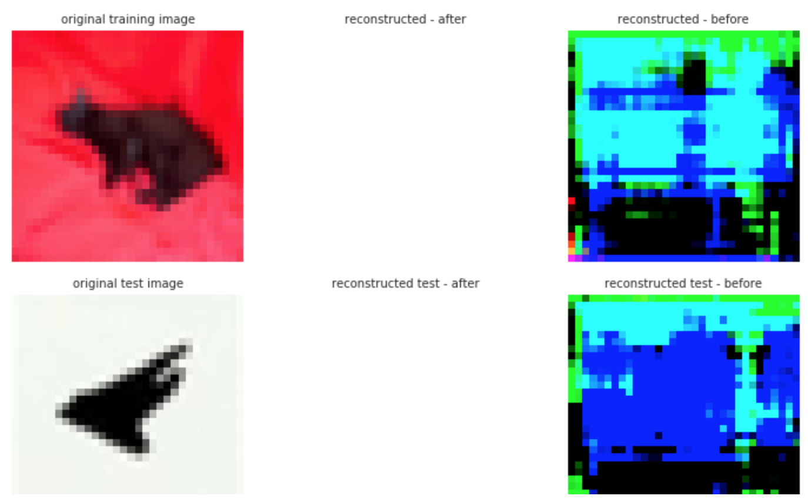
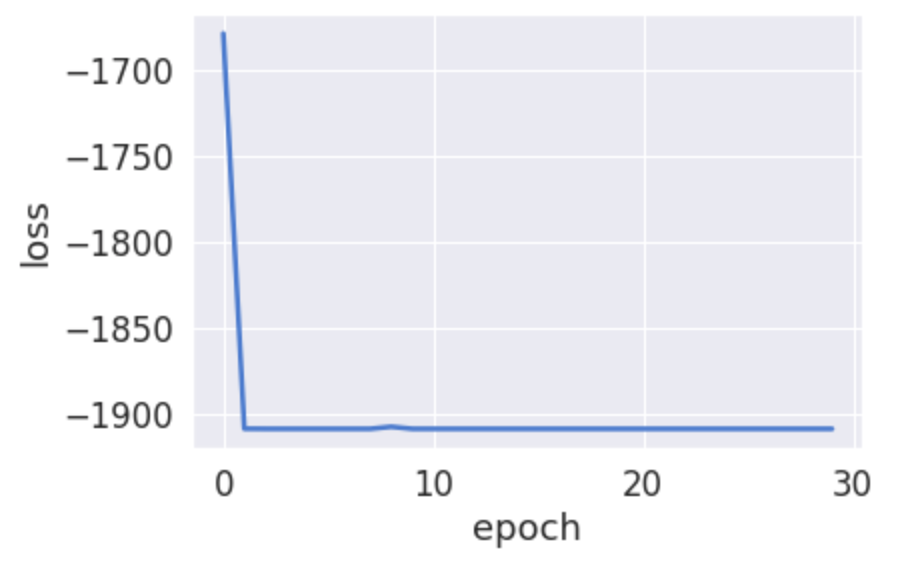

### Results

* The network architecture was definitely not adapted for this, but this shows us that there might be a problem with the cell dataset as it still does something and loss does stagnate (even though badly).
* Visualising the activations for this does show that the architecture is not adapted for this at all.

### Next up

* Need to augment the dataset to actually get something substantial out the model.
* Possibly: first combine the image pairs into one
  * Do proper testing to see if anything is learned
* Then do image augmentation on this to build a bigger dataset (at least 10,000?)
  * Scaling
  * Horizontal movement
  * Vertical movement
  * Rotation

## Model 4.1: DMSO + model 4

After finding another small dataset (~1200 images) I thought I would try again, but with the DMSO dataset, as it yielded better results with the clustering. It didn't work.

### Next up

* Trying the structure that was applied to the smaller dataset I found. If unsuccessful, back to data augmentation.

## Model 6

### Structure

```python
## model from knot classifier
input_img = Input(shape=(imw, imh, c))

x = Conv2D(16, (3, 3), activation='relu', padding='same')(input_img)
x = MaxPooling2D((2, 2), padding='same')(x)
x = Conv2D(8, (3, 3), activation='relu', padding='same')(x)
x = MaxPooling2D((2, 2), padding='same')(x)
x = Conv2D(8, (3, 3), activation='relu', padding='same')(x)
encoded = MaxPooling2D((2, 2), padding='same')(x)

x = Conv2D(8, (3, 3), activation='relu', padding='same')(encoded)
x = UpSampling2D((2, 2))(x)
x = Conv2D(8, (3, 3), activation='relu', padding='same')(x)
x = UpSampling2D((2, 2))(x)
x = Conv2D(16, (3, 3), activation='relu', padding="same")(x)
x = UpSampling2D((2, 2))(x)
decoded = Conv2D(1, (3, 3), activation='sigmoid', padding='same')(x)
```

### Parameters

* Optimiser = adam
* Loss function = binary_crossentropy
* n epochs = 30
* batch size = 48

### Images


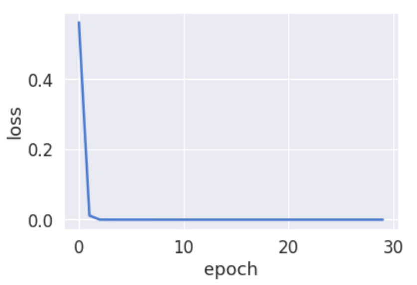

### Results

* The loss functions start stagnating!
* The weights change!
* Main difference: activation=sigmoid.
* On the other hand nothing is being reconstructed.

### Next up

* Tuning previous models but with sigmoid activation function to see if any progress.

## Model 7 - model 4 + sigmoid in last layer

### Structure

```python
x = Conv2D(64, (5, 5), padding='same')(input_img)
x = LeakyReLU()(x)
x = MaxPooling2D((2, 2), padding='same')(x)
x = Conv2D(32, (5, 5), padding='same')(x)
x = LeakyReLU()(x)
x = MaxPooling2D((2, 2), padding='same')(x)
x = Conv2D(16, (2, 2), padding='same')(x)
x = LeakyReLU()(x)
x = MaxPooling2D((2, 2), padding='same')(x)
encoded = Flatten()(x)

x = Conv2D(16, (2, 2), padding='same')(x)
x = LeakyReLU()(x)
x = UpSampling2D((2, 2))(x)
x = Conv2D(32, (5, 5), padding='same')(x)
x = LeakyReLU()(x)
x = UpSampling2D((2, 2))(x)
x =  Conv2D(64, (5, 5), padding='same')(x)
x = LeakyReLU()(x)
x = UpSampling2D((2, 2))(x)

decoded = Conv2D(1, (3, 3), activation='sigmoid', padding='same')(x)
```

### Parameters

* Optimiser = adam
* Loss function = binary_crossentropy
* n epochs = 30
* batch size = 48

### Images

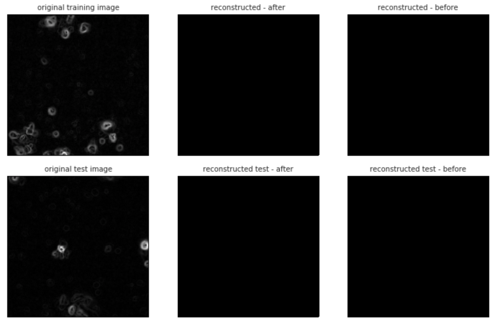
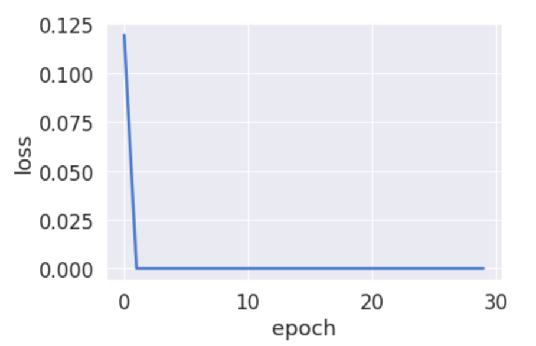
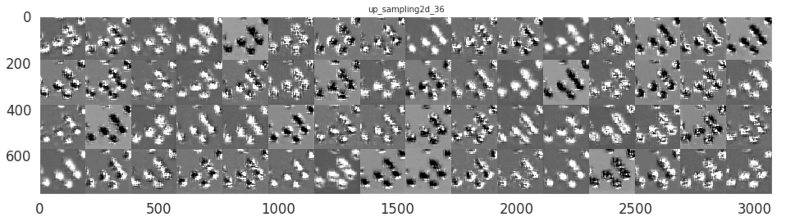

### Results

* The loss functions start stagnating!
* The weights change!
* But no output still --> sigmoid just doesn't output anything.

### Next up

* Visualise a simple architecture with sigmoid activation to see what's going on. Do more research.

## Observations: visualising layers

* Sigmoid -> MaxPooling does not translate well.
* Try: use strided convolutional layers instead of maxpooling?

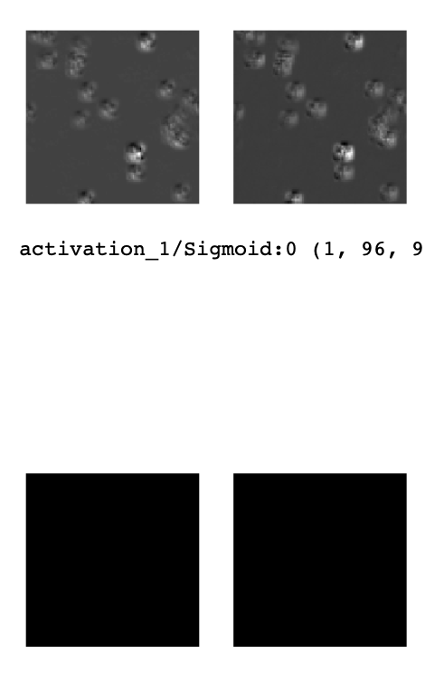

* Result: same issue changing to strides.
* Trying to visualise with old model again, but adding a separate sigmoid activation layer.
* Sigmoid produces grey.
* Try with softmax.
* (No activation returns stagnating loss and nothing learned --> that's what we learned from previous architectures)
* Softmax produces grey too.
* Using relu as the output activation function seems to get an inverted looking reconstructed image
* Finally let's try no activation to see if this goes with the results I have been having with the other models.
* Result --> normal looking image. Huh.
* Will run training again but with relu as activation function.
* Running into same loss problems etc. again.
* Running CIFAR dataset through autoencoder with sigmoid output function.

## Model 8 - CIFAR + model 7

### Structure

```python
## model from knot classifier
input_img = Input(shape=(imw, imh, c))

x = Conv2D(16, (3, 3), activation='relu', padding='same')(input_img)
x = MaxPooling2D((2, 2), padding='same')(x)
x = Conv2D(8, (3, 3), activation='relu', padding='same')(x)
x = MaxPooling2D((2, 2), padding='same')(x)
x = Conv2D(8, (3, 3), activation='relu', padding='same')(x)
encoded = MaxPooling2D((2, 2), padding='same')(x)

x = Conv2D(8, (3, 3), activation='relu', padding='same')(encoded)
x = UpSampling2D((2, 2))(x)
x = Conv2D(8, (3, 3), activation='relu', padding='same')(x)
x = UpSampling2D((2, 2))(x)
x = Conv2D(16, (3, 3), activation='relu', padding="same")(x)
x = UpSampling2D((2, 2))(x)
decoded = Conv2D(1, (3, 3), activation='sigmoid', padding='same')(x)
```

### Parameters

* Optimiser = adam
* Loss function = binary_crossentropy
* n epochs = 30
* batch size = 48

### Images

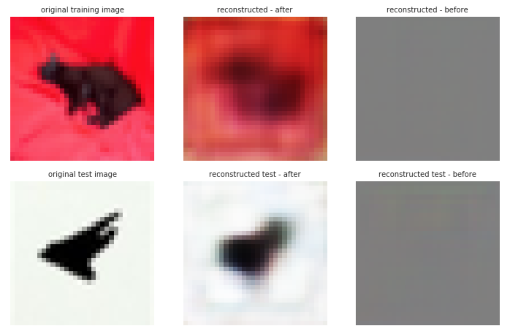
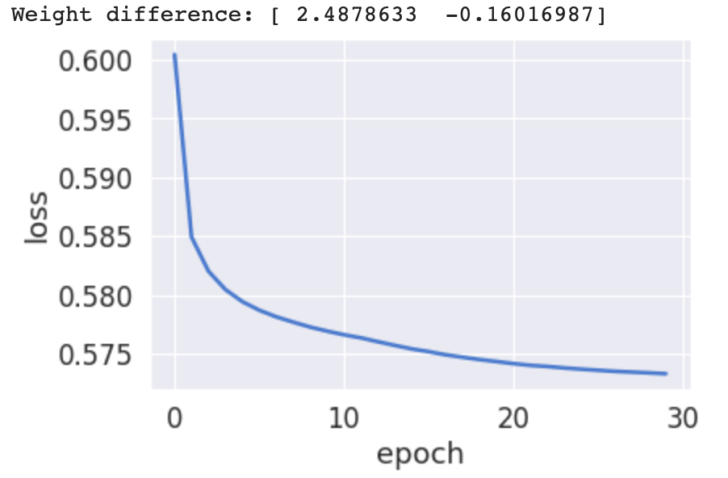

### Results

* Loss changes and stagnates, weights change,
* Main difference: activation=sigmoid.
* Image is being reconstructed.
* Is the cell dataset simply not good enough?

### Next up

* Might have to go back to data augmentation with this one.

## Observations - playing with dataset:

Dataset alterations tried:
- Making a RGB image with green/red channel each of tcell, dcell and empty third one
- Making a RGB image with the overlap as the third one    
^^ this wasn't very successful and outputted black, unless I specifically added which channel to display in the code.
- Training the network with the overlap directly
- Cropping images to [96, 96]
- Shuffling the dataset

For all of these the result is the same:
- With relu/no activation function nothing is learned but something is outputted (though no change from untrained network)
- With sigmoid function the architecture seems to learn but nothing is outputted (fully black).
  - This is just the sigmoid activation causing this.
  - Solution: try other activation functions?... but why is it not outputting
- The architecture + sigmoid on another dataset works. So what is wrong with this data?

### Next up

- Try data augmentation to make sure we can rule lack of data as the cause of the problem.
- Try brightfield images? would the network learn better from that? (however: much overhead from getting the images from OneDrive again)


---------------- old records --------------------

- add an extra convolutional layer, following each other: more lined, pixelly
- reduce filter for half the conv2d: more boxed
- more convolutional filters at beginning works better than less
- activation = sigmoid produces black
- smaller kernel size gets more pixellated results
- varying kernel size gets truer colour results
- bigger kernel size towards the centre loses points of where the bigger standouts are
- reducing maxpooling obviously keeps more detail

- this has a bit less detail but works pretty well. not sure about having two convolutions right after the other
```python
x =  Conv2D(128, (5, 5), activation='relu', padding='same')(input_img)
x = MaxPooling2D((2, 2), padding='same')(x)
x = Conv2D(64, (5, 5), activation='relu', padding='same')(x)
x = Conv2D(32, (3, 3), activation='relu', padding='same')(x)
encoded = MaxPooling2D((2, 2), padding='same')(x)

x = Conv2D(32, (3, 3), activation='relu', padding='same')(encoded)
x = Conv2D(64, (5, 5), activation='relu', padding='same')(x)
x = UpSampling2D((2, 2))(x)
x =  Conv2D(128, (5, 5), activation='relu', padding='same')(x)
# this will help going back the original image dimensions
x = UpSampling2D((2, 2))(x)

decoded = Conv2D(1, (3, 3), padding='same')(x)
```

- smaller kernel size gives more detail. for above, change second conv2d and corresponding to 3, 3 kernel size
